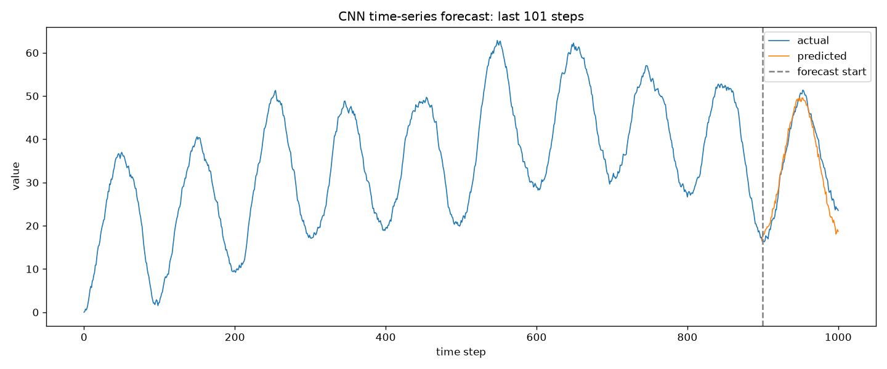
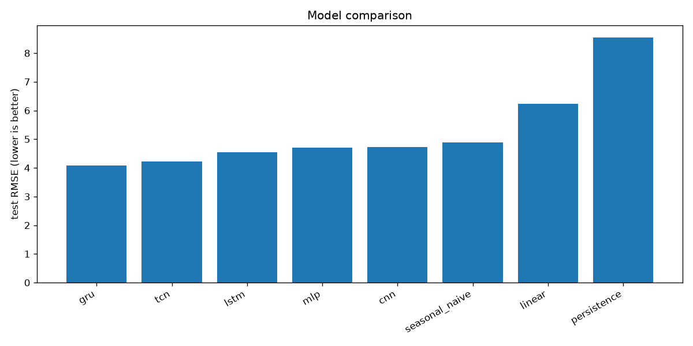
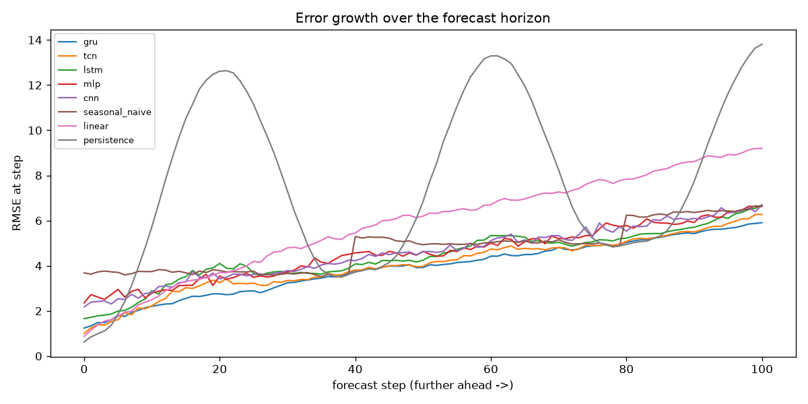
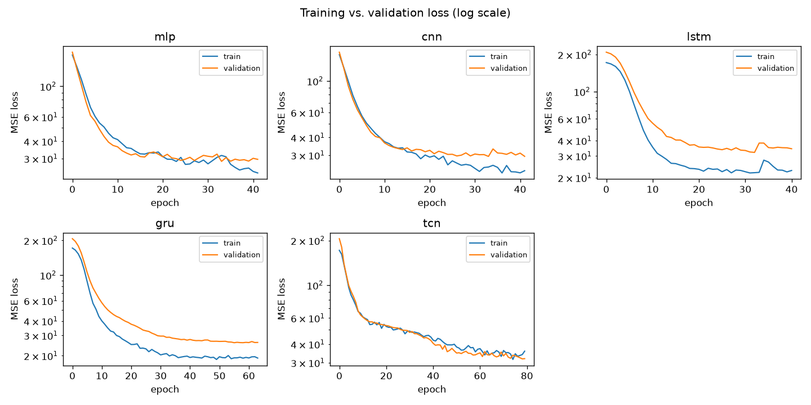
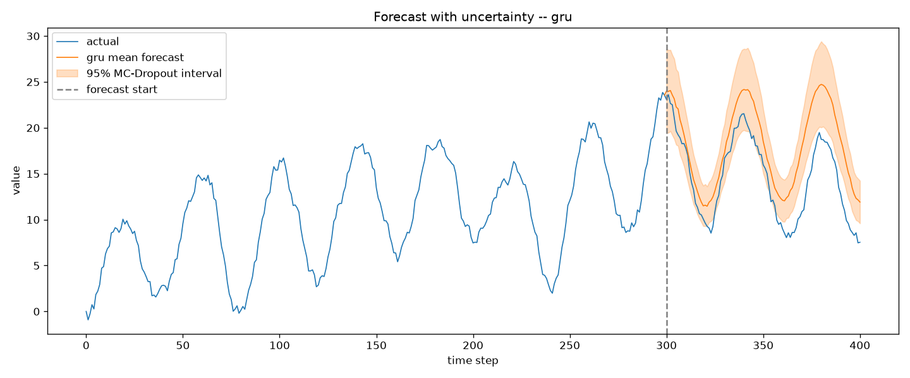

# CNN for Time-Series Prediction

A self-directed learning project exploring how a **1D Convolutional Neural
Network (CNN)** can forecast a synthetic time series. The model is shown the
first 900 steps of a sequence and learns to predict the next 101.

> **Why this repo exists.** This is one of my early personal investigations into
> deep learning. I built it to develop an intuition for how convolutional
> networks — usually associated with images — apply to *sequential* data, and to
> get hands-on with the full loop: generating data, framing a supervised
> problem, designing an architecture, training, and critically interpreting the
> results. I keep it as a record of that progression rather than as a
> production tool.



*The model is given everything left of the dashed line (steps 0–900) and
predicts the 101 steps to the right. Orange is the prediction; blue is the true
continuation.*

---

## Key results

Eight models benchmarked on the same held-out test set (lower RMSE is better).
The recurrent models win; the original CNN is competitive but heavy on
parameters. Full analysis in [the model study below](#model-study-how-does-the-cnn-stack-up).

| Model            | Test RMSE | Params  |
|------------------|----------:|--------:|
| **GRU** (best)   |  **4.08** |  21,265 |
| LSTM             |      4.54 |  25,297 |
| MLP              |      4.71 |  40,301 |
| CNN              |      4.72 | 482,193 |
| Seasonal-naive   |      4.89 |       0 |
| TCN              |      5.37 |  15,217 |
| Linear (ridge)   |      6.24 |       0 |
| Persistence      |      8.55 |       0 |

---

## Table of contents

- [Key results](#key-results)
- [Learning goals](#learning-goals)
- [The problem](#the-problem)
- [The data](#the-data-synthetic-by-design)
- [Model architecture](#model-architecture)
- [Results & interpretation](#results--interpretation)
- [Model study: how does the CNN stack up?](#model-study-how-does-the-cnn-stack-up)
- [Learning curves](#learning-curves)
- [Quantifying uncertainty](#quantifying-uncertainty)
- [Running it](#running-it)
- [Project structure](#project-structure)
- [What I learned](#what-i-learned)
- [Known limitations & next steps](#known-limitations--next-steps)

---

## Learning goals

When I started this, I wanted to answer a few concrete questions for myself:

1. **Can a CNN — not an RNN/LSTM — do sequence forecasting?** CNNs are most
   famous for images, and I wanted to see *why* 1D convolutions are a natural
   fit for time series (they learn local, shift-invariant temporal patterns).
2. **How do you frame "predict the future" as supervised learning?** i.e. the
   sliding-window idea: input = a window of the past, target = the next chunk.
3. **What does a model do when part of the signal is genuinely
   unpredictable?** I deliberately mixed a *learnable* trend with *irreducible*
   noise to see how the network behaves at that boundary.

## The problem

Given a window of past observations `x = [x₀, …, x₈₉₉]`, predict the
continuation `y = [x₉₀₀, …, x₁₀₀₀]` (101 future values) in a **single forward
pass** — a direct multi-step forecast, not an autoregressive one-step-at-a-time
loop.

## The data (synthetic by design)

Rather than download a dataset, I generate the data myself so I control exactly
how much of the signal is predictable. Each series is built step-by-step
(`src/random_walker.py`):

```
xₜ = xₜ₋₁ + sinₜ + (±fluctuation)
```

where:

- **`sinₜ`** is a sinusoidal trend, `amplitude · sin(2π · period · t / n_steps)`.
  With `period = 10` over `1000` steps, the trend completes ~10 oscillations —
  these are the regular waves you see in the plot. **This part is fully
  learnable.**
- **`±fluctuation`** is a random step (`uniform(min_step, max_step)` in a random
  direction). Accumulated over time this is a **random walk** — **pure noise,
  and fundamentally unpredictable.**

So every series is a deterministic, periodic backbone with stochastic jitter
layered on top. The split into (input, target) pairs happens in `src/data.py`,
which also produces disjoint train / validation / test splits (no series is
shared across splits). Each series uses a distinct seed, so the whole dataset is
reproducible.

> A subtle but important detail I fixed along the way: the **training and test
> data must use the same `amplitude`**. Early on they didn't, so the model was
> being evaluated on a series several times taller than anything it had seen —
> a small bug that produced misleadingly poor forecasts and a good lesson in
> train/test distribution matching.

## Model architecture

A compact 1D CNN built in Keras (`main.py`):

| Layer            | Output shape   | Params      | Role |
|------------------|----------------|-------------|------|
| `Input`          | (900, 1)       | 0           | one window, single feature |
| `Conv1D(64, k=2, relu)` | (899, 64) | 192      | learns local 2-step temporal patterns across 64 filters |
| `MaxPooling1D(2)`| (449, 64)      | 0           | downsamples, adds translation tolerance |
| `Flatten`        | (28736,)       | 0           | flattens for the dense head |
| `Dense(50, relu)`| (50,)          | 1,436,850   | mixes features globally |
| `Dense(101)`     | (101,)         | 5,151       | linear output: the 101-step forecast |

**Total: ~1.44M trainable parameters** — almost all of them in the first dense
layer, since flattening a length-449 × 64-channel feature map into a 50-unit
layer is where the weights concentrate. Trained with the **Adam** optimizer and
**mean-squared-error** loss for **200 epochs**.

## Results & interpretation

The forecast (right of the dashed line in the plot above) tracks the true
continuation closely: it gets the **phase** (when the next peak occurs) and
roughly the **amplitude** right. What it *can't* reproduce is the fine
step-to-step jitter — and that's the headline lesson:

> **The model learns the predictable structure (the sinusoidal trend) and
> sensibly "averages out" the unpredictable part (the random walk).** Training
> loss plateaus rather than going to zero, because zero loss is impossible by
> construction — you cannot predict noise. The smoother, slightly damped
> prediction curve is the network doing exactly the right thing.

This was the most valuable takeaway of the whole exercise: a flat loss isn't
always a failure to learn — sometimes it's the model correctly hitting the
**irreducible error floor** of the problem.

### A note on the forecast boundary

While investigating the plot I noticed what looked like a jump in the series
right where the forecast begins. Checking the raw numbers showed the *actual*
data is perfectly continuous there — the step across the boundary is ordinary,
and the split at step 900 is just where the series is sliced into (input,
target). The apparent jump was in the *predicted* line: the model emits all 101
future values **jointly**, with no constraint that its first prediction continue
smoothly from the last observed value, so the prediction started slightly offset
from the input. The plot now **anchors the forecast line to the last observed
point** so it reads honestly as a continuation. This is an inherent property of
direct multi-step forecasting (an autoregressive model would instead start
exactly from the last known value) — and a good reminder to verify a surprising
visual against the underlying data before trusting it.

## Model study: how does the CNN stack up?

Judging one model by eye on one series isn't evidence. To put the CNN in
context I built a small **benchmark harness** (`run_study.py`) that trains every
model on the *same* train/validation/test split and scores them with the *same*
metrics. The study runs at a slightly smaller scale than the demo (series of 400
steps, a 300-step input window, a 101-step horizon; 300/75/150 series per split)
so the recurrent models train in reasonable time — the *relative* comparison is
what matters.

**Models compared**

- **Baselines** (no learning): *persistence* (repeat the last value),
  *seasonal-naive* (repeat the last full cycle), *ridge* linear regression.
- **Neural nets**: MLP, CNN, LSTM, GRU, and a TCN (dilated causal convolutions).

**Metrics**: RMSE, MAE, and sMAPE on the held-out test set, plus per-horizon
RMSE (how error grows with how far ahead we predict) and the uncertainty
calibration metrics described below.

### Results

| model           |  RMSE |   MAE | sMAPE% |  PICP |  MPIW |   params |
|-----------------|------:|------:|-------:|------:|------:|---------:|
| **gru**         | **4.08** | **3.16** | **58.5** | 0.42 |  4.29 |   21,265 |
| lstm            | 4.54  | 3.51  |  61.0  | 0.48  |  5.26 |   25,297 |
| mlp             | 4.71  | 3.67  |  63.9  | 0.68  | 10.47 |   40,301 |
| cnn             | 4.72  | 3.67  |  62.1  | 0.67  |  9.98 |  482,193 |
| seasonal_naive  | 4.89  | 3.86  |  66.4  |  —    |  —    |        0 |
| tcn             | 5.37  | 4.32  |  69.2  | 0.46  |  6.95 |   15,217 |
| linear          | 6.24  | 4.59  |  69.6  |  —    |  —    |        0 |
| persistence     | 8.55  | 6.92  |  86.9  |  —    |  —    |        0 |



**What it shows**

- **Recurrent models win.** The **GRU** is best, with the LSTM second — their
  sequential state is well-suited to extrapolating the periodic dynamics over a
  long horizon.
- **The CNN is solid but mid-pack.** It comfortably beats the seasonal-naive,
  linear, and persistence baselines, but the RNNs edge it out — *and it does so
  with ~20× more parameters than the GRU* (482k vs 21k), almost all in its dense
  head. A good lesson in parameter efficiency.
- **Baselines matter.** Seasonal-naive — a one-line heuristic — beats both the
  TCN and the linear model here. If your "real" model can't beat a trivial
  baseline, that's a finding, not a footnote. (The TCN likely needs tuning;
  global-average-pooling its features may be discarding useful phase
  information.)

### Error growth over the horizon



Plotting RMSE *per forecast step* is more informative than a single number:

- For the learned models error grows **roughly linearly** the further ahead they
  predict — uncertainty compounds, as expected.
- **Persistence oscillates wildly**: its error dips toward zero once per full
  cycle (whenever the series happens to return near the last observed value) and
  spikes at the half-cycles. That sawtooth is a vivid illustration of *why* a
  naive baseline fails on periodic data.

## Learning curves

Train vs. validation loss per neural model (log scale) — the clearest way to
see *how* each model fit, not just how well.



- **CNN, LSTM and GRU show a train-below-validation gap** — mild overfitting,
  which is exactly what the Dropout layers and early stopping (restoring the
  best validation weights) are there to contain. The GRU reaches the lowest
  validation loss and trains the longest before stopping.
- **The TCN is different: its train and validation curves track each other but
  plateau high.** That's *underfitting*, not overfitting — so its last-place
  finish is an architecture/capacity problem, not a generalisation one. It's the
  concrete evidence behind the "needs tuning" caveat above, and a reminder that
  two models can fail for opposite reasons.

## Quantifying uncertainty

A point forecast hides how confident the model is — and with irreducible noise
in the data, confidence is exactly what we want to express. I estimate it with
**Monte-Carlo Dropout**: keep dropout active at inference and run 50 stochastic
forward passes; the spread of predictions approximates predictive uncertainty.



The shaded band is the 95% interval, and it sensibly **widens further into the
future**. I also report two calibration metrics in the table:

- **PICP** (coverage) — the fraction of true values that fall inside the nominal
  95% interval.
- **MPIW** (width) — average interval width (sharpness).

**Honest finding:** the intervals are **under-calibrated** — coverage lands at
0.42–0.68, well short of the nominal 0.95. Vanilla MC-Dropout is *overconfident*
here. It captures the *relative* shape of uncertainty (growing with horizon)
but would need post-hoc calibration — or a method like deep ensembles or
quantile regression — to hit nominal coverage. Notably the wider-interval models
(MLP, CNN) cover more truths than the sharp-but-overconfident GRU, the classic
sharpness-vs-calibration trade-off.

## Running it

This project uses [uv](https://docs.astral.sh/uv/) for environment management.

```bash
uv sync              # create .venv and install pinned dependencies
uv run main.py       # quick demo: train the CNN, write forecast.png
uv run run_study.py  # full study: train all models, write results/ table + plots
```

`main.py` saves `forecast.png` (input window + actual vs. predicted
continuation). `run_study.py` writes `results/metrics.csv` and the four plots
shown above (model comparison, per-horizon error, learning curves, uncertainty). For a fast end-to-end check of the study, `STUDY_QUICK=1 uv run
run_study.py` runs it on a tiny dataset for a few epochs.

Tested with Python 3.13, TensorFlow 2.21, and NumPy 2.4. Dependency versions are
pinned in `uv.lock` for reproducibility.

## Project structure

```
.
├── main.py                 # quick demo: train the CNN and plot one forecast
├── run_study.py            # full model-comparison study -> results/
├── src/
│   ├── random_walker.py    # generates one sinusoid + random-walk series
│   ├── data.py             # windowed dataset + train/val/test splits
│   ├── models.py           # baselines + neural architectures + trainer
│   ├── metrics.py          # RMSE, MAE, sMAPE, per-horizon error, PICP, MPIW
│   └── uncertainty.py      # Monte-Carlo Dropout predictive intervals
├── results/                # study outputs: metrics.csv + comparison plots
├── pyproject.toml          # project metadata and dependencies
├── uv.lock                 # pinned, reproducible dependency tree
└── forecast.png            # demo output plot
```

## What I learned

- **1D convolutions are a real tool for sequences**, not just an image trick —
  the `kernel_size=2` filters learn local "what comes next" patterns that
  generalise across the whole window.
- **Framing matters as much as modelling.** Most of the thinking went into the
  sliding-window setup and generating data with a *known* predictable/random
  split, not into the network itself.
- **Read the loss curve critically.** A non-zero plateau can be the correct
  answer, not a bug.
- **Train/test distributions must match** — the amplitude bug was a concrete,
  memorable example of how a tiny mismatch corrupts evaluation.
- **Always benchmark against dumb baselines.** Seeing seasonal-naive beat the
  TCN was a humbling, useful check on what "good" actually means here.
- **A point forecast isn't the whole story.** Adding uncertainty — and finding
  it *miscalibrated* — taught me more than the accuracy numbers did.

## Known limitations & next steps

This started as a single-model demo and grew into a small benchmark. The
evaluation harness, metric suite, multi-model comparison, and uncertainty
estimates were added as part of that progression. Natural next steps:

- **Calibrate the uncertainty** — temperature/variance scaling, deep ensembles,
  or quantile regression to bring PICP up to its nominal coverage.
- **Tune the weaker models** — the TCN underperforms; a proper hyperparameter
  search (depth, dilations, pooling vs. last-step readout) is warranted before
  concluding convolutions lose to recurrence.
- **Plot learning curves** — training vs. validation loss per model to make the
  fitting story explicit.
- **Try real data** — apply the same sliding-window framing to an actual time
  series (weather, finance, sensor data) where the signal/noise split is
  unknown.
- **Add tests + CI** — assert dataset shapes and that learned models beat
  persistence, and run it on every push.
